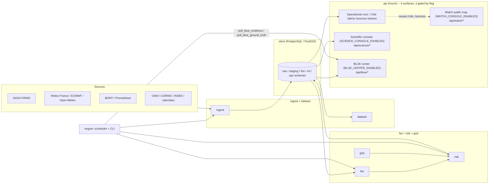

# Architecture

FireSift is a single Rust Cargo workspace of nine crates, one PostgreSQL/
PostGIS database, and one HTTP API with **four** surfaces: an always-on
operational core, and three optional consoles mounted only when their
deployment flag is enabled — a read-only scientific console, the BLUE
forecast-evidence center, and the Watch public map. All four are served
by the same `api` crate and the same `engine` binary; there is no
separate write-capable admin surface, and **none of the three optional
consoles carries its own authentication** — see [API surfaces](#api-surfaces)
below.

## Crates

| Crate | Responsibility |
|---|---|
| `engine` | Configuration, CLI commands, scheduler (FIRMS/forecast polling, BLUE evidence and ground-truth refresh, operational snapshots), orchestration, binary entry point (`pyrorisk`). The only crate that writes on a recurring schedule. |
| `api` | Axum HTTP/WebSocket API, entirely read-only. Mounts the operational core plus three independently flagged consoles: scientific, BLUE, Watch. |
| `store` | PostgreSQL/PostGIS access, migrations, repositories — the only crate that talks to the database directly, for every surface above. |
| `ingest` | Source connectors and normalization (FIRMS, Météo-France, ECMWF, Open-Meteo, BDIFF, Prométhée, OSM, CORINE, INSEE, calendars) |
| `dataset` | Scientific dataset construction and versioning |
| `quality` | Data-quality audits and validation rules |
| `risk` | Operational (v1) scoring and explainable fusion |
| `fwi` | Canadian Fire Weather Index computation |
| `grid` | H3 grid, bounding boxes, geographic conversions |

## Storage

PostgreSQL/PostGIS separates raw ingested data, staging, fire event
records, validation and quality tables, ML dataset/model registries, and
operational tables. Migrations under [`migrations/`](../migrations) are
additive SQLx migrations applied by the `engine` binary at startup;
historical migrations are treated as immutable once applied (see
[`CONTRIBUTING.md`](../CONTRIBUTING.md)).

## API surfaces

Detailed routes, parameters and stability tiers: [`docs/api.md`](api.md).
This section covers the architectural shape of each surface: what mounts
it, what protects it, and what it reads.

**A deployment flag is not authentication.** Every route below is
implemented with no login, session, token or API key of any kind — the
three `*_ENABLED` flags only decide whether Axum mounts the routes at all.
A public deployment that enables any of them without putting its own
access control in front (a reverse-proxy Basic Auth layer, an IP
allowlist, etc.) is exposing that surface to the internet unauthenticated.

| Surface | Mount flag | Default | Read-only? | Expected protection | Test coverage |
|---|---|---|---|---|---|
| Operational core | always mounted | n/a | Yes (all `GET`/`WS`) | None needed — designed to be public | Covered across `crates/api` and `crates/engine` integration tests |
| Scientific console | `SCIENCE_CONSOLE_ENABLED` | `false` | Yes | Reverse-proxy Basic Auth (Caddy) if enabled publicly | `crates/api/tests/science.rs`, 10+ integration tests |
| BLUE forecast-evidence center | `BLUE_CENTER_ENABLED` | `false` | Yes (HTTP API); ingests via scheduler, not via HTTP | Reverse-proxy protection recommended until BLUE's own maturity is reassessed | `crates/api/tests/blue.rs`, `crates/store/tests/blue_forecast.rs` — comparatively light relative to `store/src/blue.rs`'s size |
| Watch public map | `WATCH_CONSOLE_ENABLED` | `false` | Yes | None needed if published — it deliberately exposes nothing beyond what `/risk` and `/sources` already expose | `crates/api/tests/watch.rs`, 6 tests |

- **Operational core** (`/`, `/health`, `/risk`, `/risk/cell/{h3}`,
  `/alerts`, `/sources`, `/stream`) — the dashboard and the risk surfaces,
  always mounted, no flag.
- **Scientific console** (`/science`, `/api/science/*`) — read-only,
  gated behind `SCIENCE_CONSOLE_ENABLED`; every route is `GET`. See
  [`docs/research/reports/SCIENTIFIC_CONSOLE_ARCHITECTURE.md`](research/reports/SCIENTIFIC_CONSOLE_ARCHITECTURE.md).
- **BLUE forecast-evidence center** — see [BLUE](#blue-forecast-evidence-center) below.
- **Watch public map** — see [Watch](#watch-public-map) below.

### BLUE forecast-evidence center

`/blue`, `/blue/{*path}`, `/blue.css`, `/blue.js`, and the read-only
`/api/blue/*` routes (`overview`, `bulletins`, `performance`,
`ground-truth`, `cases`, `alerts`, `alerts/{id}`), gated behind
`BLUE_CENTER_ENABLED` (default `false`). BLUE is an **active, real
foundation** — not a mockup — but it is a **partial** one:

- **Forecast evidence**: `engine`'s scheduler runs `poll_blue_evidence`
  (and publishes a daily bulletin from `poll_forecast` when the flag is
  on) to archive `+24h`/`+48h` forecast snapshots as an immutable record,
  before the outcome is known — the basic precondition for any honest
  prospective validation.
- **Requires an active v1 human model**: `capture_blue_daily_bulletin`
  (`crates/store/src/blue.rs`) refuses to publish a bulletin with a
  `"no active BLUE model"` error if `ml.human_model_versions` has no
  active row. A deployment running purely on the heuristic fallback
  (no learned model ever trained/activated) will never produce a BLUE
  bulletin, even with `BLUE_CENTER_ENABLED=true` and real forecast data
  flowing — confirmed by running the full pipeline locally with real
  data and no active model.
- **AI-assisted evidence, when actually configured**: a second flag,
  `BLUE_AI_EVIDENCE_ENABLED` (default `false`), turns on an OpenAI-backed
  automatic evidence reviewer (`crates/engine/src/scheduler.rs`) that
  only runs if `OPENAI_API_KEY` is also set — otherwise the scheduler
  logs a warning and evidence review stays manual/absent.
  `BLUE_FEUX_DE_FORET_ENABLED` narrows that reviewer's scope. This is
  real, wired code, not a design placeholder — but it is off by default
  and requires an external API key to do anything.
- **Terrain / community evidence**: migration `0032_blue_community_evidence.sql`
  (the most recent migration as of this writing) adds
  `evidence_level` values `community_reported`, `press_confirmed`, and
  `authority_confirmed` to `blue.ground_truth_confirmations`, plus a
  separate `blue.ground_truth_rejections` table so a community report
  that turns out to be a false alarm is archived apart from confirmed
  matches and can never itself create a positive ground-truth match.
- **Scheduler-driven, not request-driven**: all BLUE writes happen from
  `engine`'s background tasks (`poll_blue_evidence`,
  `poll_blue_ground_truth`); the HTTP API under `/api/blue/*` is
  entirely `GET`.

**BLUE is not a complete prospective-validation system.** It is the
foundation for one: an immutable archive plus bounded evidence checks.
Reverse matching for recall/specificity and a published aggregate track
record do not exist yet — see
[`docs/scientific-limitations.md`](scientific-limitations.md#prospective-validation-is-partially-implemented-not-complete).
Test coverage (a handful of tests against ~1,600 lines in
`crates/store/src/blue.rs`) is light relative to the surface's size.

### Watch public map

`/watch`, `/watch/{*path}`, `/watch.css`, `/watch.js`, and the read-only
`/api/watch/*` routes (`communes`, `communes/{insee_code}`), gated behind
`WATCH_CONSOLE_ENABLED` (default `false`). Watch is an **experimental,
public-facing map console**, not an alerting product:

- It reuses the existing operational `/risk`, `/risk/cell/{h3}`,
  `/sources`, and `/config` routes unchanged — the only new server-side
  logic is commune name search and bbox lookup
  (`crates/api/src/watch.rs`, `Store::search_communes`).
- It has **no migration of its own**: commune data comes from the
  `commune` table added by `0023_commune_boundary.sql` for the
  territorial console.
- It is disabled by default and, like every other console here, carries
  no authentication of its own.
- It explicitly presents itself as **not an official wildfire warning**;
  see the disclaimer rendered in the UI itself and
  [`docs/scientific-limitations.md`](scientific-limitations.md).

## Deployment shape

FireSift runs as a single container (see [`Dockerfile`](../Dockerfile))
against a private PostgreSQL/PostGIS instance, with a reverse proxy
(Caddy) as the only public entry point. See
[`docs/deployment.md`](deployment.md) for a generic deployment guide.
