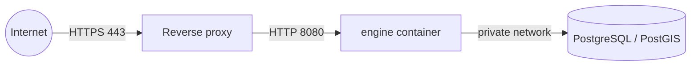

# Deployment

This is a generic guide to running FireSift in production. It intentionally
does not describe any specific hosting provider, IP address, or hostname —
those belong to whoever operates a given deployment, not to this
repository. A reference deployment against Oracle Cloud's free tier exists
at [`deploy/oracle/`](../deploy/oracle/README.md) with real commands, but
any identifying infrastructure details it once referenced (public IPs,
hostnames) have been redacted to placeholders; treat it as a worked example
to adapt, not a live runbook for a repository-owned server.

## Shape

- One container running the `engine` binary (built from
  [`Dockerfile`](../Dockerfile)), non-root (`USER pyrorisk`, uid 10001).
- One private PostgreSQL/PostGIS instance, not exposed publicly.
- A reverse proxy (Caddy in the reference deployment) as the only public
  entry point, terminating TLS.

## Configuration

All runtime configuration is environment variables (see
[`.env.example`](../.env.example) for local/fixture defaults and
[`.env.production.example`](../.env.production.example) for a production
shape). Never commit a real `.env`; both example files are placeholder-only
and must stay that way (see [`SECURITY.md`](../SECURITY.md)).

Key production settings:

- `DATA_PROFILE=production` — refuses fixture files, missing static
  layers, and silent ingestion failures. Use this in any real deployment;
  `fixture` is for local development only.
- `FIRMS_MAP_KEY`, `METEOFRANCE_API_KEY` — real upstream credentials, never
  committed.
- `BLUE_CENTER_ENABLED` — no longer gates any HTTP route (the interface
  was removed, see [`docs/api.md`](api.md)); it only controls whether the
  scheduler keeps archiving BLUE forecast evidence in the background.
- `TERRITORY_GEOJSON_PATH`, `TERRITORY_CODES`, `AOI_BBOX`, `H3_RESOLUTION`
  — define the area of interest; do not silently widen an AOI beyond what
  its static layers actually cover (see the note about not publishing
  Aude-pilot fixtures as a France-wide surface in
  [`deploy/oracle/README.md`](../deploy/oracle/README.md)).

## Database

- Run PostgreSQL/PostGIS on a private network only; do not expose port
  5432 publicly.
- Migrations under [`migrations/`](../migrations) apply automatically at
  engine startup and are additive/idempotent by design — see
  [`CONTRIBUTING.md`](../CONTRIBUTING.md) for the rule that applied
  migrations are never edited retroactively.
- Back up regularly; the reference deployment's backup scripts
  ([`deploy/oracle/backup-local.sh`](../deploy/oracle/backup-local.sh),
  [`backup-r2.sh`](../deploy/oracle/backup-r2.sh)) are a worked example of
  a local + off-site (Cloudflare R2) rolling backup, not a requirement to
  use R2 specifically.

## Volumes and persistence

- PostgreSQL data on a named volume.
- No trained-model binary or dataset export is expected to live inside the
  container image beyond the bundled `testdata/` fixtures — real data
  stays outside the image, per [`docs/data-sources.md`](data-sources.md).

## HTTPS

Terminate TLS at the reverse proxy, not in the `engine` binary itself. The
reference [`Caddyfile`](../deploy/oracle/Caddyfile) shows automatic HTTPS
via Let's Encrypt for a real domain, and plain HTTP-by-IP for an initial
bring-up.

## What this repository will not do for you

Per project scope, FireSift does not ship Kubernetes manifests, Terraform,
Helm charts, or a multi-service orchestration layer — the operational
shape above (one container, one database, one reverse proxy) is
deliberately simple. See [`ROADMAP.md`](../ROADMAP.md) for what's actually
planned versus out of scope.
